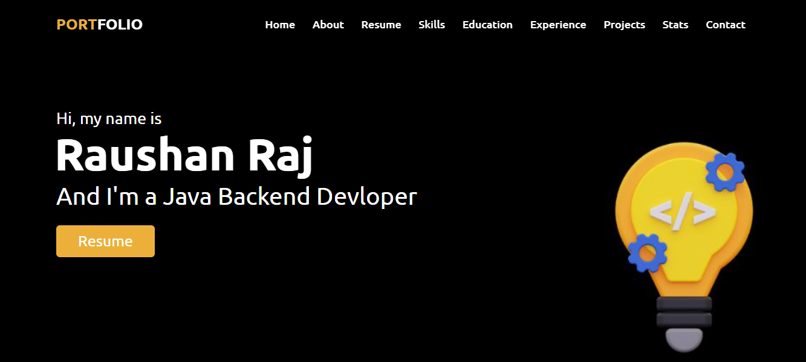
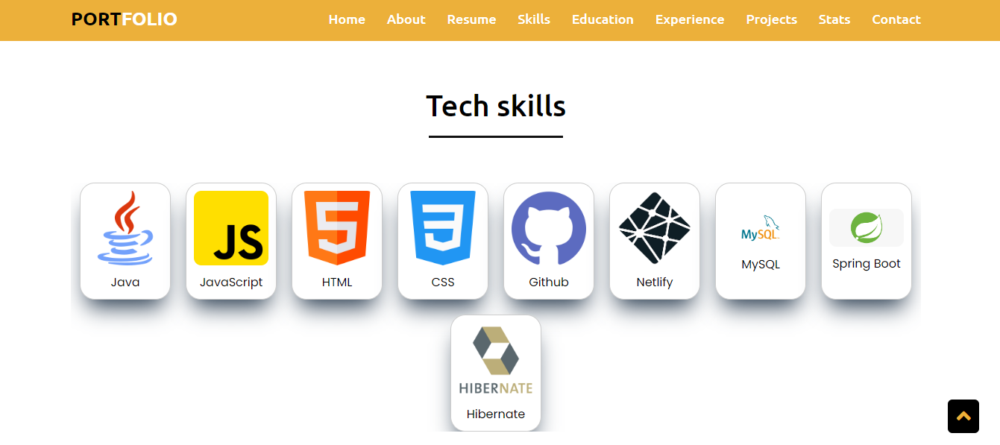
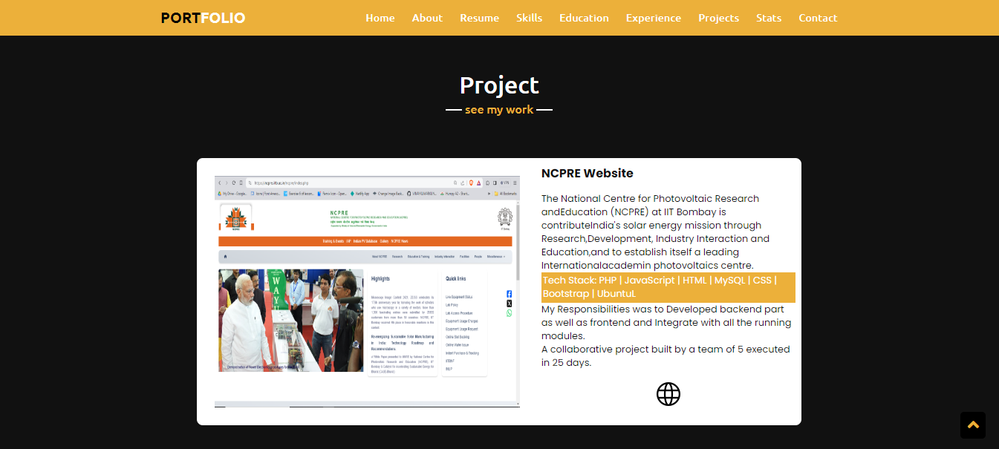

<h1 align="center"> Hi, Everyone <a href="https://raushanraj901.github.io/" target="_blank"> Welcome </a></h1>
<h3 align="center" >-----  Created My Protofolio  -----</h3>
<h1 align="center"><a href="https://raushanraj901.github.io/" target="_blank">Protofolio</a></h1>

<h2 align="left"><i>Tech Stack Use for Creating My Protofolio</i></h2>

 

<h2 align="left"><i>You can find Protofolio link here</i></h2>
  
<h3 align="left"><a href="https://raushanraj901.github.io/" target="_blank"> Protofolio ( https://raushanraj901.github.io/ )</a></h3>

<h2>Responsibilities<h2>

Created the total protofolio and the function by using Tech Stack like HTML, CSS, JS. In this project i used JS, CSS for the animation part of the protofolio which gives my protofolio a unique look.

<h4> NavBar </h4>
 

  
  
 

<h4> Skills Part</h4>
 

  
  
 

 
 <h4> Education and Projects Part </h4>
 

  
  
 

<h1 align="center">  Thank You  </h1>
